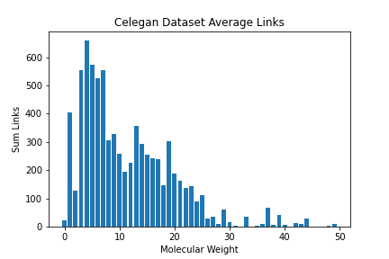
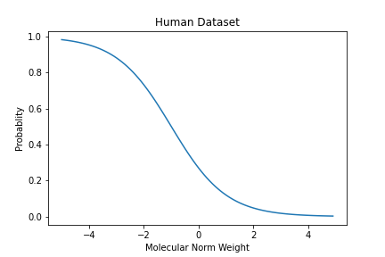
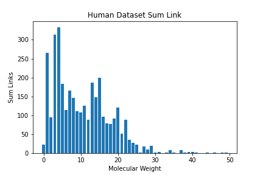
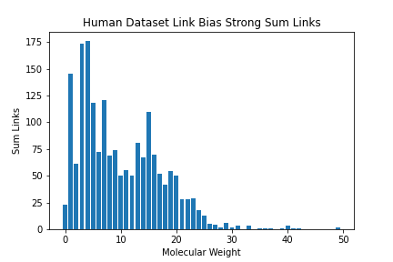

# 研究概要
## 問題設定
- Input: drug(化合物), target(タンパク質)
- Output: probability(反応可能性) y:{0,1}
- ストーリー:
    - 化合物とタンパク質の反応を当てる問題は重要である
    - (現状)
        - 化合物は、PubChemのデータベースで3500万種類登録されているが、化合物ータンパク質は7000未満（2013年時点）であり、データとして非常に少ない
        - しかし、実験される化合物には、研究者や実験プロセスによって、バイアスが強くかかっていて、観測される化合物には、偏りがある。その結果、精度が出づらい
        - 観測バイアスによる考慮がされていない
    - (解決策)
        - 化合物の観測確率を計算し、逆数として学習することで、精度の向上を図る
        - 観測確率の計算方法（2種類）
            - 観測確率 = 化合物のリンク数 
            - 訓練データ（バイアスのあるデータ）→ 1、テストデータ（バイアスのないデータ）→ 0、とする。そのあと、新しい分類器を作成し、入力を訓練データとテストデータに含まれる化合物、出力を訓練データかテストデータかの0,1とする。p(dataset=1)をプロペンシティスコアにする。

        （あくまで、今回は化合物の観測確率の偏りのみを考慮する）
    - イメージ  
    

## 手法
- Inverse Propensity Score
    - 観測さてている確率の逆数を用いて、学習する 
    損失関数： $L = \frac{1}{p} \sum^{N}_{i=1} l (f(d_{i},t_{i}), y_{i})$
      f = モデル, d = 化合物, t = タンパク質, y = ラベル, l = 各データの損失関数
    - p = 化合物のリンク数  

## データセットの分析
- ヒトのデータセット
    - 全データ数：6728, 正例数：3364, 負例数：3364
    - 化合物数：2726, タンパク質数：2001
    - データセットの分布 
    
    - 分子量ごとの平均のリンク数 
    
    - 分子量ごとの合計のリンク数 
    
    
- 線虫のデータセット
    - 全データ数：7786, 正例数：3893, 負例数：3893
    - 化合物数：2726, タンパク質数：2001
    - データセットの分布 
    
    - 分子量ごとの平均のリンク数 
    
    - 分子量ごとの合計のリンク数 
    

## 実験方法
- バイアスの入れ方 
    - 分子量に比例するように入れる
        - バイアスを化合物に入れる場合 
        バイアスによって確率的に、観測される化合物と観測されない化合物がある場合
            - 懸念： **そもそも、平均リンク数に分子量による差がない**
        - バイアスをリンクに入れる場合 
        バイアスによって確率的に、観測されるリンクと観測されないリンクがある場合
    - データの作る手順
        - 分子量をまず、正規化する 
        
        - 正規化した分子量に、シグモイド関数を当てはめて、確率を計算する 
        
        - 確率をもとに、データセットを構築する
    - バイアスを少し強くする場合は、シグモイド関数をx方向に-1した 
        
    - バイアスをより強くする場合は、シグモイド関数をx方向に-2した 
        
    - 重みは、観測されたリンク数で重み付け（最小=0.1, 最大=0.9として制限）  
    **最小=0.1, 最大=0.9として制限は必要か？**

- 実験設定
    - 100回実験を行いその平均をとる
     

## 結果
**変わらない**。しかし、本当に少しではあるが、バイアスを強くすれば、精度は上昇する。

- バイアスを化合物に入れる場合 

|提案手法 / データセット|  ヒト  |  線虫  |
|----| ---- | ---- |
|ベースライン|  0.884(±0.024) |  0.913(±0.018)  |
|提案手法|  0.884(±0.020)  |  0.911(±0.021)  |

 

- バイアスをリンクに入れる場合 

|提案手法 / データセット|  ヒト  |  線虫  |
|----| ---- | ---- |
|ベースライン|  0.882(±0.014) |  0.904(±0.017)  |
|提案手法|  0.882(±0.014)  |  0.906(±0.018)  |

 

- より強いバイアスをリンクに入れる場合 

|提案手法 / データセット|  ヒト  |  線虫  |
|----| ---- | ---- |
|ベースライン|  0.842(±0.017) |  0.862(±0.022)  |
|提案手法|  0.842(±0.016)  |  0.862 (±0.020)  |

 

- さらに強いバイアスをリンクに入れる場合 

|提案手法 / データセット|  ヒト  |  線虫  |
|----| ---- | ---- |
|ベースライン|  0.732(±0.059) |  0.786(±0.050)  |
|提案手法|  0.734(±0.058)  |  0.788(±0.046)  |

 

- バイアスをリンクに入れる場合(重みに情景を追加しない場合) 

|提案手法 / データセット|  ヒト  |  線虫  |
|----| ---- | ---- |
|ベースライン|  0.880(±0.015) |  0.910(±0.014)  |
|提案手法|  0.880(±0.015)  |  0.909(±0.015)  |

 

## 考察
- うまくいかない理由への考察:   **そもそもバイアスがあまり乗っていない** 

ヒトのデータセットの、観測された化合物の平均リンク数を見てみると、まず全体では、次のようになっている。 

 

化合物にバイアスを入れた時 

 

リンクにバイアスを入れた時 

 

観測されている化合物の平均リンク数を見ているので、最低でもリンク数は1を持つ。上の場合でも、バイアスは入っているように見えるが、もう少し強くしてみる。

リンクに少し強いバイアスを入れた時 

 

より強くしてみる。
リンクにより強いバイアスを入れた時 

 

 

ヒトのデータセットの、観測された化合物の合計リンク数を見てみると、まず全体では、次のようになっている。 

 

化合物にバイアスを入れた時         

 

リンクにバイアスを入れた時 

 

観測されている化合物の平均リンク数を見ているので、最低でもリンク数は1を持つ。

上の場合でも、バイアスは入っているように見えるが、もう少し強くしてみる。

リンクにもう少し強いバイアスを入れた時  

 

より強くしてみる。
リンクにもう少し強いバイアスを入れた時 

 

## 疑問点
- 本当に少しではあるが、バイアスを強くすれば、精度は上昇した。データセットが小さくこのデータセットでは厳しいかもしれないが、他のデータセットで、より強いバイアスをかけることで、精度は上昇するのか？
- バイアスの入れ方は、これで合っているのか、合理的か？ 
- 各重みを最小=0.1, 最大=0.9として制限しているが、その制限は必要か？
  - ほぼ関係ない
- 複数のデータセットでやってみるべきなのか？

## やるべきこと
- 実験結果から、方針を決める

## やったこと
- ベースライン候補
    - （×）Prediction of drug-target interaction networks from the integration of chemical and genomic spaces
    (化合物のSMILES形式のデータ、タンパク質のアミノ酸配列のデータがない)
    - （○）Compound–protein interaction prediction with end-to-end learning of neural networks for graphs and sequences 
    （self-attentionとかを使っていて、複雑になっている、少し簡略化して実験）
- ベースラインの実装
    - 上記の論文と同様のタスクを行うと、同等の性能 
    （AUC=0.96を達成、論文の提案手法とほぼ同じ）

## これから
- リンクのバイアスに関する研究が見つからないので、引き続き探す
    - CCI(compound compund Interaction)のバイアスも、一つ一つの化合物のバイアスならあるが、リンクごとのバイアスは、どのような状況なのか
- drugやprotein、DNA、diseaseはネットワークを構成している。それぞれ、類似していたり、同じタンパク質を原因、ターゲットにしていることがある。これが、バイアスにおいてどのように、効いてくるのかについて考える。
